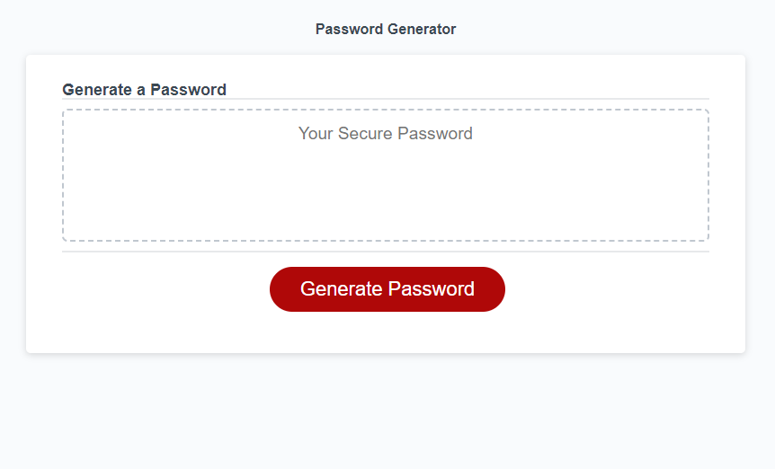

# Random Password Generator

## Desctiption:
The Random Password Generator Application will generate a random password with the users
desired criteria. They will be prompted to  give a desired length for the password that must
be a number between 8 and 128. Then the user is prompted with a series of prompts
asking if they would like lowercase letters, uppercase letters, numbers and special
symbols. They must choose at least 1 of the criteria if not it will not generate a 
password. After making selections of the approved criteria the Random Password 
Generator will generate a password with random characters that meet the criteria 
given by the user at the length desired. 

## Assets:

The following image demonstrates the web application's appearance and functionality:

## The URL of the deployed application:

https://jerrickjohnson.github.io/Random-Password-Generator/

## The URL of the GitHub repository:

https://github.com/JerrickJohnson/Random-Password-Generator.git

